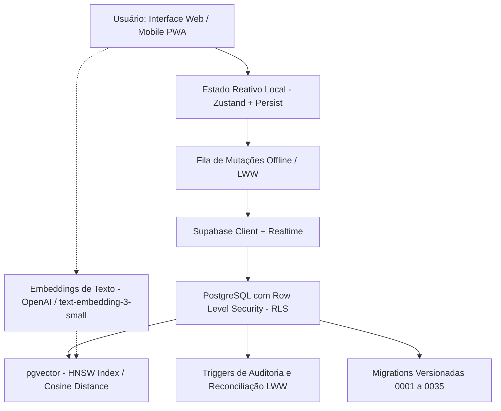
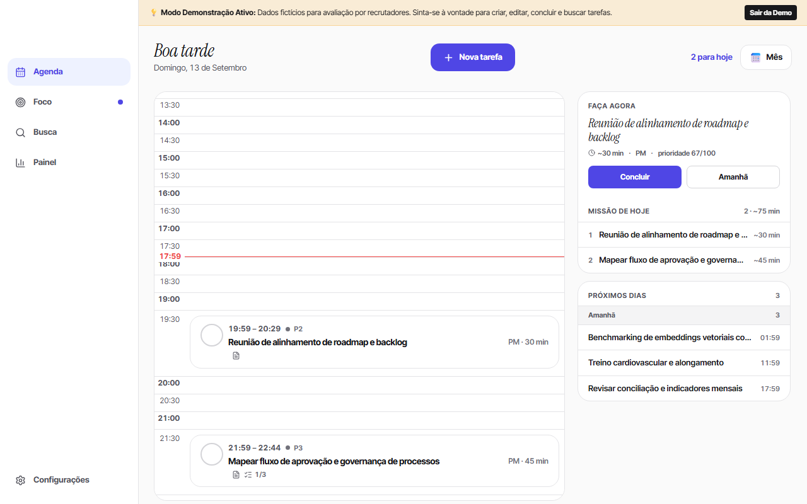

# SecretárioTask

Laboratório de produtividade, organização de informação e busca semântica utilizando **PostgreSQL**, **pgvector** e **desenvolvimento assistido por IA**.

---

## Visão Geral

O **SecretárioTask** foi desenvolvido como um laboratório prático para investigar como arquiteturas modernas de banco de dados relacionais — combinadas com extensões vetoriais (**pgvector**) e modelos de linguagem — podem transformar sistemas de organização e produtividade pessoal.

Em vez de ser apenas mais um gerenciador de afazeres ("to-do list"), o foco do projeto reside em:
1. **Recuperação semântica de intenções:** encontrar tarefas pelo sentido contextual e não apenas por palavras-chave exatas.
2. **Resolução de conflitos distribuídos:** reconciliação de concorrência com estratégia *Last-Write-Wins* (LWW) entre múltiplos dispositivos (desktop, notebook e mobile).
3. **Governança estrita de banco de dados:** migrações SQL declarativas versionadas, particionamento lógico por contextos de vida e políticas de segurança por linha (**Row Level Security - RLS**).

---

## O Problema que Aborda

- **Limitação da busca textual exata:** ao buscar "consertar carro", ferramentas convencionais não encontram "levar veículo na oficina mecânica" por falta de termos coincidentes.
- **Sobrecarga de priorização:** listas acumuladas geram paralisia decisória quando não há distinção clara de nível de energia, contexto e impacto da tarefa.
- **Sincronização entre múltiplos dispositivos:** edições simultâneas ou realizadas em momentos offline correm o risco de sobrescrever alterações ou corromper o estado local.

---

## A Solução Técnica

O SecretárioTask combina um cliente web reativo (React + Zustand) com recursos nativos avançados do PostgreSQL hospedado no Supabase:



---

## Engenharia e Conceitos Demonstrados

### 1. Busca Semântica e pgvector
O sistema utiliza a extensão `vector` do PostgreSQL para armazenar representações vetoriais (*embeddings*) de cada tarefa:
- **Indexação HNSW:** criação de índices *Hierarchical Navigable Small World* sobre as colunas vetoriais para permitir busca de vizinhos mais próximos em tempo sub-milissegundo.
- **Distância por Cosseno:** cálculo de similaridade semântica entre a intenção digitada pelo usuário e a base histórica de tarefas cadastradas.

### 2. Governança de Schema e Migrations
- Mais de 30 migrações SQL versionadas, numeradas e reversíveis em `supabase/migrations/`.
- Nenhuma alteração manual ou improvisada no banco de produção: cada evolução de tabela, índice ou função é declarada e auditável via Git.

### 3. Concorrência e Reconciliação LWW (*Last-Write-Wins*)
- Estratégia de resolução de concorrência implementada tanto na aplicação quanto em triggers SQL.
- Cada mutação carrega carimbo temporal e versão base para garantir convergência de dados caso edições ocorram simultaneamente em conexões instáveis.

### 4. Isolamento e Segurança com RLS (*Row Level Security*)
- 100% das tabelas possuem RLS habilitado.
- Políticas atreladas diretamente a `auth.uid() = user_id`, impedindo que qualquer usuário tenha acesso ou visibilidade sobre dados de terceiros, mesmo utilizando a chave pública da API.

### 5. Frontend Reativo e Otimização Mobile
- Construído com **React 19**, **TypeScript**, **Vite** e **Tailwind CSS**.
- Gerenciamento de estado global com **Zustand** (armazenamento resiliente e mitigação defensiva de estouro de quota em *localStorage*).
- PWA instalável com suporte a service workers para operação confiável no smartphone.

---

## Demonstração Visual (Modo Demo Ativo)

O projeto inclui um **Modo Demonstração** integrado para permitir que recrutadores e avaliadores técnicos naveguem por todas as interfaces com dados fictícios, sem necessidade de cadastro prévio:



---

## Como Testar (Para Avaliadores e Recrutadores)

### Acesso Rápido Online
1. Acesse o deploy público: [secretario-task.vercel.app](https://secretario-task.vercel.app)
2. Na tela de login, clique no botão: **"✨ Acessar Modo Demonstração (Sem Cadastro)"** (ou utilize a URL direta com parâmetro `?demo=true`).
3. O app inicializará imediatamente com dados fictícios realistas, permitindo testar a agenda, foco, alternância de contextos e busca.

---

## Como Executar Localmente

### Pré-requisitos
- Node.js 20+ e npm.

### Instalação e Execução
```bash
git clone https://github.com/josemardp/secretario-task.git
cd secretario-task
npm install
npm run dev
```

### Execução de Testes e Validações
```bash
# Rodar as suítes de fixtures e invariantes do Decision Engine:
npm test

# Validação estática de código (ESLint):
npm run lint

# Build de produção:
npm run build
```

---

## Segurança e Privacidade

- **Proteção de Dados Pessoais:** O repositório não contém dados pessoais, e-mails, notas ou credenciais de acesso reais.
- **Variáveis de Ambiente:** Arquivos `.env` e credenciais de banco são estritamente ignorados pelo `.gitignore`.
- **Modo Demo Seguro:** O modo de demonstração opera em memória e *localStorage* local com dados sintéticos, isolado do banco de dados pessoal de produção.

---

## Sobre o Desenvolvimento

Este projeto foi construído como uma iniciativa pessoal e laboratório de aprendizagem em **IA aplicada, bancos de dados modernos (pgvector) e arquitetura de software reativo**.

O desenvolvimento foi conduzido com **uso intensivo de assistentes de Inteligência Artificial** para apoio na ideação, prototipagem, geração de código TypeScript/SQL e refinamento de algoritmos de parsing. A concepção dos fluxos de produtividade, arquitetura de persistência, testes de invariantes e validação das decisões técnicas foram lideradas pelo autor.

---

## Status do Projeto

- **Fase:** Funcional em produção (web e mobile PWA) com Modo Demo para avaliadores.
- **Testes:** 100% dos testes e fixtures verdes.
- **Build & Lint:** 100% em conformidade (Vite, TypeScript, ESLint).
